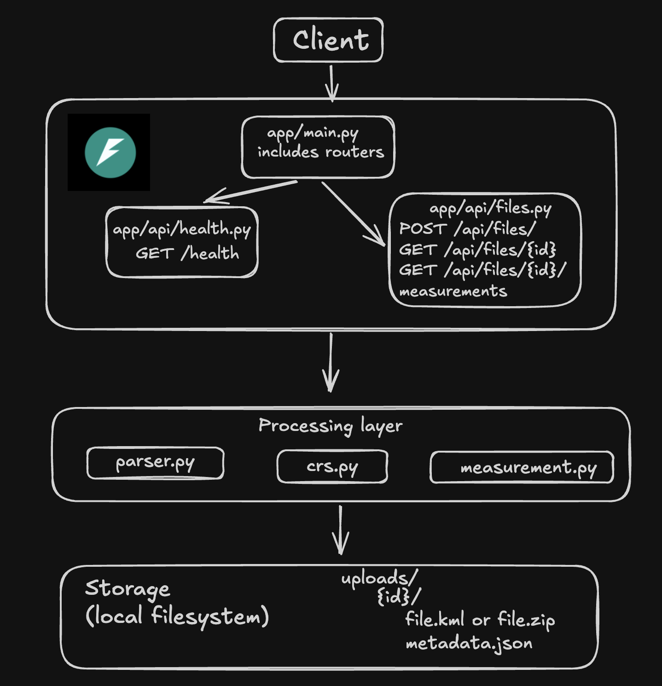

# GeoLens

A FastAPI backend that accepts a geospatial file (a **KML** file or a **ZIP containing a Shapefile**), extracts its features, and returns measurement information: **area** for polygons and **length** for lines, calculated in a projected, metre-based coordinate system.

- Upload a file: `POST /api/files/`
- Read the file's information and features: `GET /api/files/{id}/`
- Read the measurements: `GET /api/files/{id}/measurements/`

## Setup

Prerequisites: [uv](https://docs.astral.sh/uv/) and Python 3.12 or newer (developed and tested on 3.12; uv can download a suitable Python if you do not have one). GDAL does **not** need to be installed separately; the Python wheels used here bundle it.

```bash
git clone <repository-url> geoLens
cd geoLens
uv sync
uv run uvicorn app.main:app --reload
```

The server listens on http://localhost:8000.

- Interactive API docs (Swagger UI): http://localhost:8000/docs
- Health check: `curl http://localhost:8000/health` → `{"status":"ok"}`

Uploaded files are stored under `uploads/` in the project root (created automatically, not committed). There is no database and no configuration to set.

## API

All three endpoints live under `/api/files/`. IDs are 32-character lowercase hex strings generated on upload.

### `POST /api/files/` — upload

Multipart form upload with a single field named `file`. Accepted extensions: `.kml`, `.zip` (a ZIP containing a Shapefile). The file is stored as-is and given an ID; it is parsed when you request it with the GET endpoints.

```bash
curl -F "file=@survey.kml" http://localhost:8000/api/files/
```

`201 Created`:

```json
{"id": "3f2a9c0d4b7e4d1a8c5e6f7a8b9c0d1e", "filename": "survey.kml", "status": "UPLOADED"}
```

- `201` → file stored
- `400` → uploaded part has no filename
- `415` → extension is not `.kml` or `.zip`
- `422` → no `file` field in the request
- `500` → the file could not be written to disk

### `GET /api/files/{id}/` — file information and features

Parses the stored file and returns the file information plus every feature: its index, geometry type, geometry, CRS and properties.

```bash
curl http://localhost:8000/api/files/3f2a9c0d4b7e4d1a8c5e6f7a8b9c0d1e/
```

`200 OK` (shortened; for a Shapefile ZIP `sample.zip` containing two polygons in EPSG:32643):

```json
{
  "id": "3f2a9c0d4b7e4d1a8c5e6f7a8b9c0d1e",
  "filename": "sample.zip",
  "feature_count": 2,
  "crs": "EPSG:32643",
  "status": "COMPLETED",
  "features": [
    {
      "id": 0,
      "geometry_type": "Polygon",
      "geometry": {
        "type": "Polygon",
        "coordinates": [[[500000.0, 1435000.0], [500000.0, 1435100.0], [500100.0, 1435100.0], [500100.0, 1435000.0], [500000.0, 1435000.0]]]
      },
      "crs": "EPSG:32643",
      "properties": {"name": "Plot A", "crop": "wheat", "rows": 12}
    },
    {
      "id": 1,
      "geometry_type": "Polygon",
      "geometry": {"type": "Polygon", "coordinates": ["..."]},
      "crs": "EPSG:32643",
      "properties": {"name": "Plot B", "crop": null, "rows": 7}
    }
  ]
}
```

Notes:

- `id` (per feature) is the 0-based position of the feature in the file. For KML, features from all Folders are numbered continuously in file order.
- `geometry` is a GeoJSON-style geometry object produced from the parsed Shapely geometry. **Its coordinates stay in the file's own CRS** (given in `crs`) and are not reprojected, so it is not necessarily longitude/latitude. A feature without geometry has `"geometry": null` and `"geometry_type": null`. Z values are kept when present.
- `crs` is `EPSG:<code>` when the CRS has an EPSG code, otherwise the CRS name, and `null` if the file declares no CRS (for example a Shapefile without a `.prj`).
- `properties` are the attributes of the feature. For KML they include the standard fields GDAL exposes (`Name`, `description`, `timestamp`, ...) plus any `ExtendedData`.
- `status` is `COMPLETED` when the file was parsed successfully by this request. The file is re-parsed on every request; nothing is cached.

### `GET /api/files/{id}/measurements/` — measurements

Parses the file, brings the geometries into a metre-based projected CRS (see [CRS handling](#crs-handling)), and measures each feature.

```bash
curl http://localhost:8000/api/files/3f2a9c0d4b7e4d1a8c5e6f7a8b9c0d1e/measurements/
```

`200 OK` for a KML file in EPSG:4326 with a polygon, a line, a point and a `MultiGeometry`:

```json
{
  "id": "3f2a9c0d4b7e4d1a8c5e6f7a8b9c0d1e",
  "measurement_crs": "EPSG:32643",
  "measurements": [
    {"feature_id": 0, "geometry_type": "Polygon", "area_sq_m": 12016.970249021719, "length_m": null, "note": null},
    {"feature_id": 1, "geometry_type": "LineString", "area_sq_m": null, "length_m": 586.2127593883339, "note": null},
    {"feature_id": 2, "geometry_type": "Point", "area_sq_m": null, "length_m": null, "note": "No measurement defined for Point"},
    {"feature_id": 3, "geometry_type": "GeometryCollection", "area_sq_m": null, "length_m": null, "note": "Unsupported geometry type for measurement: GeometryCollection"}
  ]
}
```

- `area_sq_m` is set for `Polygon` / `MultiPolygon` (square metres, holes subtracted, parts summed).
- `length_m` is set for `LineString` / `MultiLineString` (metres, parts summed).
- `Point`, `MultiPoint` and any other geometry type (for example `GeometryCollection`) get no measurement and an explanatory `note`. Features with no geometry, or an empty geometry, get a note too. None of these is an error.
- A geometry that is not valid (for example a self-intersecting polygon) is **not repaired**; it is measured as-is and carries the note `"Geometry is invalid; value may be unreliable"`.
- `measurement_crs` is the CRS the values were computed in. It is `null` when there was nothing to measure (no feature has a usable geometry).
- Values are not rounded.

### Errors (both GET endpoints)

Errors use FastAPI's standard body, `{"detail": "<message>"}`.

- `404` → unknown or malformed ID
- `422` → the stored file cannot be parsed (invalid KML, not a valid ZIP, no `.shp`, missing `.shx`/`.dbf`, more than one Shapefile, malformed Shapefile)
- `422` → measurements only: the file has no CRS
- `422` → measurements only: no measurement CRS can be chosen (data beyond 84°N / 80°S or impossible coordinates)
- `500` → the upload directory exists but its stored file or `metadata.json` is missing or corrupt

Because the upload endpoint does not parse, a malformed file is accepted with `201` and reported with `422` when it is read (see [Design decisions](#design-decisions)). A file with no CRS can still be read with `GET /api/files/{id}/` (it returns `"crs": null`); only the measurements are refused.

## Architecture



### Application structure

```text
app/
├── main.py              # FastAPI app; registers the routers
├── api/
│   ├── health.py        # GET /health
│   └── files.py         # upload + the two GET endpoints, response models, upload-directory lookup
└── services/            # framework-independent processing; no FastAPI imports
    ├── parser.py        # KML / Shapefile ZIP  ->  ParsedFile(crs, features)
    ├── crs.py           # ParsedFile  ->  ProjectedFile (metre-based CRS)
    └── measurement.py   # ProjectedFile  ->  list[FeatureMeasurement]
uploads/                 # created at runtime: uploads/<id>/file.kml|file.zip + metadata.json
```

The routes in `files.py` only handle HTTP concerns (validation of the ID, filesystem lookup, mapping service errors to status codes, response models). All geospatial logic lives in `services/`, where each stage consumes the previous stage's result and each module raises one module-specific exception (`GeoParseError`, `CRSHandlingError`, `MeasurementError`) that the routes translate into `422`.

Internal data structures (frozen dataclasses): `Feature(id, geometry_type, geometry, crs, properties)`, `ParsedFile(crs, features)`, `ProjectedFile(source_crs, measurement_crs, transformed, features)` and `FeatureMeasurement(...)`. The API uses separate Pydantic response models, so the HTTP contract is independent of the internal types.

### File-processing flow

```text
POST /api/files/
  -> check the extension (.kml / .zip)
  -> generate an id (uuid4 hex), independent of the client filename
  -> stream the upload to uploads/<id>/file.<ext>
  -> write uploads/<id>/metadata.json  {"id", "filename" (original name), "status": "UPLOADED"}
  -> 201 {id, filename, status}

GET /api/files/{id}/
  -> validate the id (32 hex chars) and locate uploads/<id>/
  -> parse_file(): choose the reader by extension
       .kml : read every layer (one per Folder/Document) with GeoPandas/pyogrio (GDAL)
       .zip : validate and extract the Shapefile components, then read it (below)
  -> normalize every row into a Feature (index, geometry type, Shapely geometry, CRS, properties)
  -> 200 file information + features
```

Shapefile ZIP handling:

1. The archive must contain exactly one `.shp` together with its `.shx` and `.dbf` (a `.prj` and `.cpg` are used if present). Otherwise a descriptive `422` is returned. macOS `__MACOSX/` and `._*` entries are ignored.
2. Only those component files are extracted, into a temporary directory, under **fixed names** (`shapefile.shp`, `shapefile.dbf`, ...). Names and directory components from inside the archive are never used to build a path, which rules out path traversal ("Zip Slip"), and `extractall` is never called.
3. The Shapefile is read into memory and the temporary directory is removed immediately afterwards (also when reading fails). The original uploaded ZIP is never modified, so it stays available for later requests.

### Measurement calculation flow

```text
GET /api/files/{id}/measurements/
  -> locate and parse the file                  (parser.parse_file)
  -> choose one metre-based CRS and transform   (crs.project_for_measurement)
  -> measure each feature                       (measurement.measure_file)
  -> 200 {id, measurement_crs, measurements}
```

`measure_file` works only on the already-projected geometries and does no CRS handling of its own. Each feature is dispatched on its Shapely geometry type: `Polygon`/`MultiPolygon` use `.area`, `LineString`/`MultiLineString` use `.length`, everything else yields no measurement and a note. Measurements are planar and 2D (Z values are ignored, so lengths are horizontal distances). A file without any CRS raises an error here, because its coordinates cannot be interpreted; a file that has a CRS but no usable geometry simply yields notes.

### CRS handling

The assignment requires that area and distance are never computed on latitude/longitude degrees. One **measurement CRS is chosen per file** from the CRS that was read from the file (it is read and preserved by the parser, never assumed), and every geometry is transformed into it before measuring:

- none (e.g. Shapefile without `.prj`) → **never guessed.** Nothing is transformed; the file can be read (`crs: null`) but measurements return `422`.
- projected, in metres, not a Mercator / Pseudo-Mercator projection (e.g. UTM EPSG:32643, national grids) → used as-is, **no transformation**.
- geographic (e.g. EPSG:4326) → transformed to a UTM zone.
- projected but in feet (e.g. EPSG:2263), or Mercator / Web Mercator (EPSG:3857) → transformed to a UTM zone.
- anything else (geocentric, engineering, ...) → `422`: unsupported CRS type.

**UTM selection:** the zone is the WGS 84 UTM zone (EPSG:326xx north, EPSG:327xx south) containing the centre of the combined bounds of all geometries in the file, computed with GeoPandas' `estimate_utm_crs()` on the usable (non-null, non-empty) geometries. The transformation is done in one batch with pyproj (via GeoPandas). The result is always metre-based, so values are always square metres and metres.

Details:

- Null and empty geometries are carried over unchanged and ignored when locating the file.
- Invalid geometries are transformed as-is, never repaired.
- Data beyond 84°N / 80°S (outside UTM) or with impossible coordinates (e.g. latitude 200°) fails with `422`; a post-transform check also rejects non-finite coordinates.
- The geometry returned by `GET /api/files/{id}/` is always in the **original** CRS; the projected geometries are only used for measuring.

## Design decisions

- **FastAPI rather than Django.** The service is a small, stateless API: FastAPI gives request validation, Pydantic response models and interactive docs (`/docs`) with very little code. Django + DRF would add an ORM and project scaffolding that this assignment does not need.
- **Filesystem storage instead of a database.** Each upload lives in `uploads/<id>/` with a small `metadata.json` holding the original filename. The ID comes from `uuid4`, never from the client filename, and the stored name is built only from the ID and an allowlisted extension, so a hostile filename cannot influence the path. Alternatives considered: SQLite/PostgreSQL (more moving parts, and nothing here needs queries), object storage (unnecessary locally). The cost is that there is no listing, no atomic status tracking and no cleanup of old uploads.
- **Upload stores, GET processes (lazy processing).** `POST` only validates the extension and stores the file; parsing, CRS handling and measuring run when the data is requested. This keeps the upload fast and means no processing state has to be persisted: the status `COMPLETED` is derived ("parsed successfully on this request") and the stored `metadata.json` stays `UPLOADED`. The trade-offs: each GET re-parses the file, and a malformed file is accepted at upload and only rejected (`422`) when read. Alternative considered: parse at upload time, reject bad files immediately and persist the results; this would need persistence for the results or a status field, which was out of scope here.
- **GeoPandas (pyogrio / GDAL) for reading, one dependency.** It reads both KML and Shapefile, yields Shapely geometries and pyproj CRS objects, and the same stack does the transformation and the measurements. Alternatives: `fiona` (older engine), a dedicated KML library or hand-written XML parsing (more code, more edge cases). Caveat: GDAL's KML driver exposes one layer per Folder, so all layers are read explicitly, and it adds its own standard columns to the properties.
- **Services separated from the web layer.** Parsing, CRS selection and measurement are plain functions over dataclasses, each in its own module with a single exception type, so the routes contain no geospatial logic and each stage can be exercised on its own.
- **One UTM zone per file.** Alternatives: a zone per feature (slightly more accurate for far-apart features, but the file would have no single measurement CRS and values would come from different projections); geodesic (ellipsoidal) calculation with `pyproj.Geod` (very accurate, but the assignment asks for a projected CRS); an equal-area projection centred on the data (exact areas but no EPSG code and distorted lengths); Web Mercator (rejected, it inflates areas by roughly 1/cos²(latitude), about 4× at 60° latitude). UTM is conformal, metre-based, has EPSG codes that can be reported, and keeps the error within a zone at roughly 0.1 % or less. Checked on the sample KML (a 0.001° × 0.001° polygon near 13°N): 12016.97 m² and a 586.21 m line against 12003.11 m² and 585.87 m from an independent ellipsoidal calculation.
- **A projected CRS is only trusted if it is in metres and not Mercator.** This is a deliberate simplification: it guarantees unambiguous square-metre and metre results at the cost of re-projecting some inputs (feet-based or Web Mercator data) that could in principle be measured directly. Other metre-based projections are trusted as given; their area of use is not checked.
- **A missing CRS is never assumed.** Silently assuming EPSG:4326 would produce confidently wrong areas for a projected file. The file stays readable; measuring it returns a clear `422`.
- **Unsupported geometries are handled gracefully, not rejected.** Parsing identifies every geometry; measurement returns a `note` for `Point`, `MultiPoint`, `GeometryCollection` and other types (collections are not recursed into, to keep the rule predictable).
- **Invalid geometries are flagged, not repaired.** Repairing changes the user's data and can hide problems; a note tells the client the value may be unreliable.
- **Geometry in the response stays in the source CRS.** Reprojecting the output would add CRS logic the assignment does not ask for, and the `crs` field says how to interpret the coordinates. The geometry objects are GeoJSON-style dictionaries, which are not necessarily WGS 84 (strict RFC 7946 GeoJSON is).
- **Separate response models.** The Pydantic models define the HTTP contract and are decoupled from the internal dataclasses, so internals can change without breaking the API.
- **Error handling stays simple.** Service-specific errors become `422`, an unknown ID `404`, a damaged upload directory `500`; unexpected exceptions are left to FastAPI's default handling instead of being swallowed.
- **No automated test suite.** The assignment does not require one, so the pipeline was verified manually against small hand-made KML and Shapefile samples with known answers (for example a 100 m × 100 m square, a 3-4-5 triangle line, and a comparison against an independent geodesic calculation). An automated suite would be the first addition for a production service (see Future scope).

## Command-line helpers

For inspecting each processing stage without the API:

```bash
uv run python -m app.services.parser       <file.kml|file.zip>   # parsed features and CRS
uv run python -m app.services.crs          <file.kml|file.zip>   # source CRS, measurement CRS, original vs projected geometry
uv run python -m app.services.measurement  <file.kml|file.zip>   # per-feature area / length
```

## Learning

- **GDAL's KML driver is layer-based.** A KML with several Folders is exposed as several layers, and reading a file without a layer name silently returns only the first, so features would go missing. It also adds its own columns (`Name`, `description`, `timestamp`, `tessellate`, ...) next to `ExtendedData` values.
- **A Shapefile holds exactly one geometry type** (and is really a set of files: `.shp`, `.shx`, `.dbf`, optionally `.prj`), so mixed-geometry test data has to come from KML, and the missing `.prj` case is a real, common situation that must be handled explicitly.
- **Safe archive handling.** A ZIP's member names are untrusted input. Looking members up by name and writing them to fixed filenames in a temporary directory avoids Zip Slip without having to sanitize paths.
- **Why not measure in degrees.** The same polygon has an area of about `0.000001` "square degrees" and about 12,017 m² once projected; and a degree of longitude shrinks with latitude. Not every projected CRS is safe either: Web Mercator is metre-based but distorts areas heavily, and feet-based CRSs would make units ambiguous.
- **UTM zone selection and its limits.** Zones are 6° wide, the choice follows the centre of the data, data beyond 84°N / 80°S has no UTM zone, and distortion grows for files spanning many zones.
- **PROJ edge cases.** Out-of-range coordinates do not always raise: a transformation can silently return infinite coordinates, so the result has to be checked.
- **Making results JSON-safe.** DataFrame missing values (`NaN`/`NaT`) must be turned into `None` before they reach the response, and Shapely geometries need an explicit serialization (`mapping()`) that matches the coordinates' actual CRS.
- **Designing for a no-database constraint.** Deriving state (`COMPLETED`) from what happens on each request, and keeping the original filename in a small metadata file, removes the need for any persistence layer, at the price of re-processing per request.
- **FastAPI details.** Blocking file and geospatial work belongs in plain `def` routes (run in a threadpool); path parameters that end up in filesystem paths must be validated before use.

## Future scope and limitations

Limitations of the current implementation:

- Files are parsed on every request; there is no persistence of results, caching, or processing status. Large files will be slow, and uploads are neither size-limited nor expired.
- A malformed file is only detected when it is read, not at upload time.
- No pagination: `GET /api/files/{id}/` returns every feature with its full geometry.
- Accuracy degrades for files spanning many UTM zones (one zone per file); data crossing the antimeridian is not handled meaningfully; data beyond 84°N / 80°S is rejected.
- `GeometryCollection` contents are not measured; invalid geometries are measured as-is with a warning.
- KML `properties` include GDAL's standard KML columns, unfiltered.
- A projected CRS in metres is accepted without checking that it suits the data's location.
- Only KML and Shapefile ZIP are supported, one Shapefile per archive.

Possible next steps:

- Process at upload time (optionally in a background worker) and store results and a real `status` in a database such as PostgreSQL/PostGIS; listing and deleting uploads; retention and size limits.
- Automated tests and CI; a Dockerfile.
- Protection against decompression bombs and upload size limits.
- Pagination, filtering, or a bounding-box summary for large files; optional reprojection of returned geometry to WGS 84.
- Better CRS handling: UPS for polar data, per-feature or equal-area options for very large extents, validation of a projected CRS's area of use, and geodesic measurement as an alternative.
- Measuring the contents of `GeometryCollection`s, optional geometry repair, and more input formats (GeoJSON, GeoPackage).
- Authentication and rate limiting if the service is exposed publicly.
